# 1. Introduction

The **Market Intelligence Hub** is an AI-powered platform that aggregates, curates and distributes reliable market intelligence to Prysmian's business units. It transforms scattered Excel files, news feeds and CRM/ERP data into a single source of truth, with audit-grade traceability and always-on AI agents that monitor the market on your behalf.

**What it does, in one sentence:**
six AI agents continuously scan public sources (news, mining projects, KPI signals, competitor moves, customer events) and write back *evidence-backed insights* into a central Hub, where the MI team can validate them before they reach the wider organization.

**Who it's for:**
- **MI team** — review and validate AI drafts before publishing
- **Country managers / BU leads** — daily intelligence on their geography and product line
- **Sales** — Share-of-Wallet insight on key customers
- **Executives** — high-level dashboards and alerts

This manual covers every screen and every function in the demo build.

---

# 2. Accessing the platform

The platform is web-based — open it in any modern browser (Chrome, Edge, Firefox, Safari).

**Demo URL:** `https://mi-hub-web.onrender.com`

## 2.1 Login

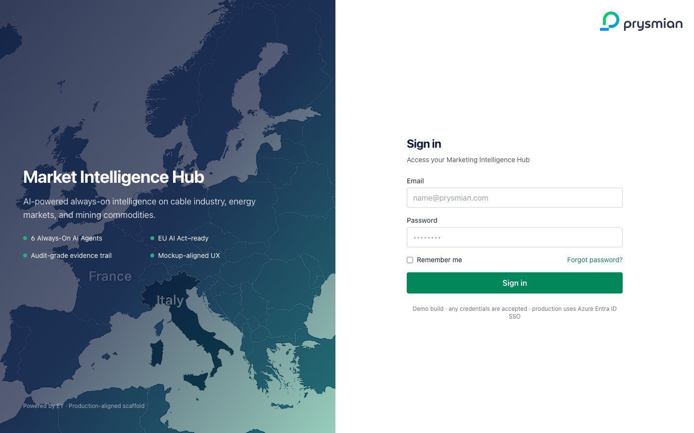

The split-screen login shows:

- **Left panel** — branded hero with the Market Intelligence Hub value proposition: 6 always-on AI agents, EU AI Act ready, audit-grade evidence trail.
- **Right panel** — sign-in form: email + password, "Remember me" checkbox, "Forgot password?" link.

In production this will use **Azure Entra ID (SSO)**. In the demo build any non-empty email + password is accepted.

**To sign in:**
1. Enter your corporate email
2. Enter your password
3. Click **Sign in**

> 💡 The demo banner under the button reminds you that demo credentials are not validated. Production uses SSO with role-based access control (RBAC).

---

# 3. The Dashboard

After login you land on the **Dashboard** — your daily briefing screen.

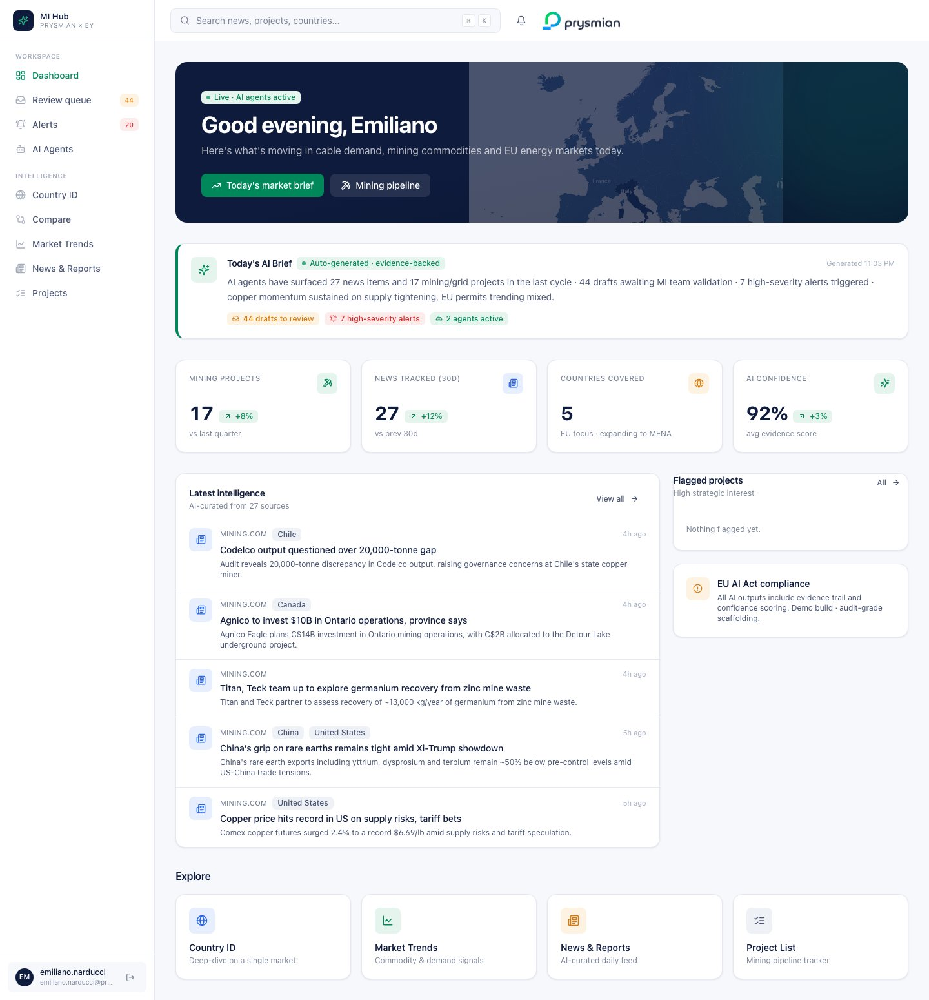

## 3.1 Page anatomy

### 3.1.1 Left sidebar — navigation

The sidebar is split into two groups:

- **Workspace** (operational tasks)
  - **Dashboard** — this screen, the daily briefing
  - **Review queue** — AI drafts awaiting your validation, with a badge counter
  - **Alerts** — triggered alerts (KPI deviations, competitor moves), with unread counter
  - **AI Agents** — control center for the 6 monitoring agents

- **Intelligence** (data exploration)
  - **Country ID** — per-country deep-dive
  - **Compare** — side-by-side country comparison
  - **Market Trends** — commodities, GDP, construction indicators
  - **News & Reports** — full news feed
  - **Projects** — mining/grid project pipeline

The active page is highlighted in **Prysmian green**. The user pod at the bottom shows your initials and email with a one-click **Logout** button.

### 3.1.2 Top bar — search and notifications

- **Search bar** — click or press **⌘K** (Mac) / **Ctrl+K** (Windows) to open the global search palette
- **Bell icon** — quick notifications shortcut
- **Prysmian logo** — top right

### 3.1.3 Hero greeting

The header welcomes you by name with the current time-of-day greeting ("Good morning / afternoon / evening, *Your Name*"). The "Live · AI agents active" badge confirms the AI is running in the background. Two quick-action buttons take you to today's market brief and the mining pipeline.

### 3.1.4 Today's AI Brief

A green-bordered card auto-generates a one-paragraph executive summary using live numbers from the database. It cites:

- Number of news items and projects surfaced by agents
- Drafts awaiting MI team validation
- High-severity alerts triggered
- Headline market signal (e.g., copper momentum)

Three chip-links jump directly to the **Review queue**, **Alerts inbox**, and **Agents** page — these are your one-click entry points to take action.

> The brief regenerates every page load and is timestamped (top right). The `evidence-backed` badge indicates every claim is traceable to a source.

### 3.1.5 KPI strip

Four headline metrics:

| KPI                | What it shows                                  |
|--------------------|------------------------------------------------|
| Mining projects    | Total in the database, with quarterly delta    |
| News tracked (30d) | News items in the last 30 days                 |
| Countries covered  | EU footprint (expanding to MENA in Phase 2)    |
| AI confidence      | Average evidence score across AI outputs       |

Each KPI shows an arrow (▲ / ▼) and percentage delta when applicable.

### 3.1.6 Latest intelligence feed

The two-column workspace block:

- **Left (large)** — AI-curated news with source, country tags, age, headline and 2-line summary. Click any item to open the source URL.
- **Right (small)** — "Flagged projects" mini-list (strategic interest only), plus the **EU AI Act compliance** info card reminding you that all AI outputs are evidence-backed.

### 3.1.7 Explore cards

Four shortcut cards (Country ID · Market Trends · News & Reports · Project List) for quick navigation. Each shows a color-coded icon and one-line description.

---

# 4. Global Search (⌘K)

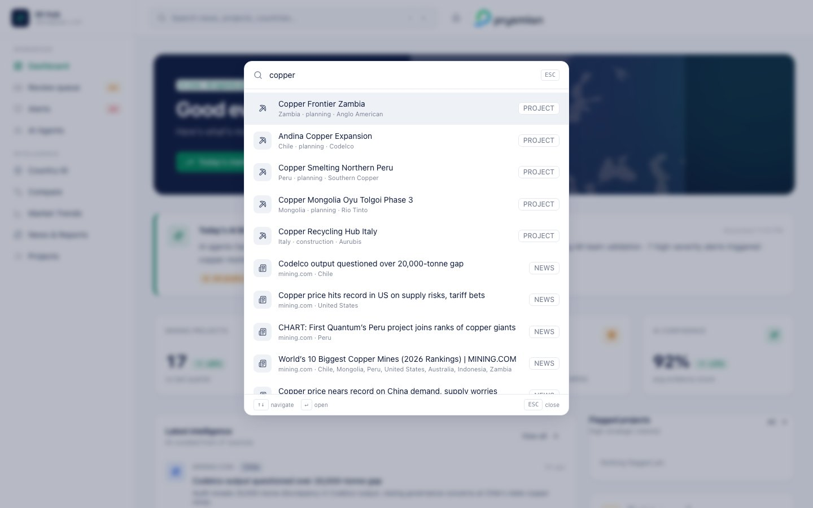

The global search is available **on every screen** via the search bar in the header or the keyboard shortcut **⌘K**.

## 4.1 How it works

- Start typing (minimum 2 characters) — results stream as you type with a 180ms debounce
- Results are grouped by type: **Country** · **Project** · **News**
- Each row shows a type icon, the item title, a sub-line (source/country/status), and a colored type chip

## 4.2 Keyboard navigation

| Key   | Action            |
|-------|-------------------|
| ↑ / ↓ | Move selection    |
| Enter | Open selected     |
| ESC   | Close the palette |

Hovering with the mouse also moves the selection. Click a row to navigate directly to that page or open the source URL.

## 4.3 Suggested queries

Try `copper`, `Italy`, `EV`, a competitor name, a project name, or an owner. The backend full-text search runs across news titles, summaries, project names, owners and countries.

---

# 5. Review Queue (Human-in-the-Loop)

This is the **operational heart** of the platform — where AI drafts become published intelligence after your validation. It implements the workflow the briefing document calls for: **draft → validated → published**, with feedback captured to improve the agents over time.

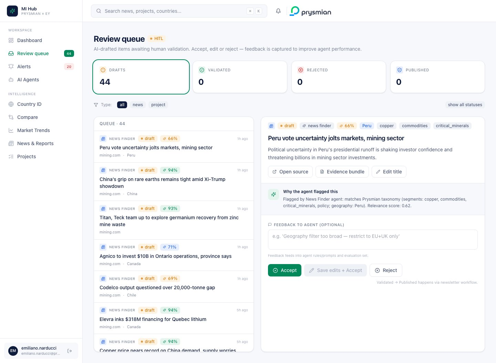

## 5.1 Top stat pills

Four big tiles at the top show **counts by status** and act as filters:

- **Drafts** (amber) — AI-produced items not yet reviewed
- **Validated** (green) — accepted by the MI team, awaiting publish
- **Rejected** (red) — discarded; agent learns from these
- **Published** (blue) — live in the Hub and visible to consumers

Click any pill to filter the queue by that status. The active filter shows a green ring.

## 5.2 Type filter

Below the pills:

- `all` · `news` · `project` — narrow by item type
- `show all statuses` — bypass the status filter

## 5.3 Master-detail layout

### 5.3.1 Left pane — the queue list

Each row shows:

- **Type icon** — newspaper (news) or pickaxe (project)
- **Agent label** — which agent flagged this item
- **Status chip** — current state
- **Confidence chip** — AI confidence score (green ≥ 85%, blue 70–84%, amber < 70%)
- **Title** (2 lines max)
- **Source** and **country**
- **Age** — "4h ago", "2d ago"

Click an item to inspect it in the right pane.

### 5.3.2 Right pane — the detail view

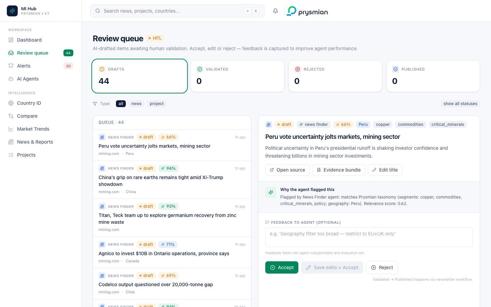

**Header section** shows:

- Type icon, status, agent, confidence, country, segments
- The item **title** (editable inline — click *Edit title*)
- The AI-extracted **summary**
- Three action buttons: **Open source** · **Evidence bundle** · **Edit title**

**"Why the agent flagged this"** — a callout that quotes the AI reasoning, e.g.

> Flagged by News Finder agent: matches Prysmian taxonomy (segments: copper, commodities; geography: Peru). Relevance score: 0.62.

This is the **evidence trail** the brief explicitly requires.

**Feedback to agent** — a textarea where you write *why* you accept/edit/reject:

> e.g. "Geography filter too broad — restrict to EU+UK only"

The text feeds back into the agent's rules and evaluation set.

**Three decision buttons:**

| Button             | Effect                                                              |
|--------------------|---------------------------------------------------------------------|
| **Accept** (green) | Status → `validated`. Item moves to publish queue.                  |
| **Save edits + Accept** | Saves your edited title *and* validates the item.              |
| **Reject** (white) | Status → `rejected`. Feedback feeds agent improvement loop.         |

### 5.3.3 Decision history strip

Once an item has been decided, the detail panel shows:

> Decided 3m ago by `emiliano.narducci@prysmian.com`
> "Geography too broad, restrict to Italy."

This is the **audit trail** — who/when/feedback for every state transition.

## 5.4 The validated → published step

When an item is in `validated` state, the right panel offers a single button **"Publish now"** that transitions it to `published`. In production this is wired to the newsletter / editorial workflow.

Rejected items get a **"Restore to queue"** button so a wrongly-rejected item can be brought back.

## 5.5 Live counter

The sidebar **Review queue** badge updates every 20 seconds with the current draft count — so you always know how much work is queued.

---

# 6. AI Agents Control Center

The brief specifies **six always-on AI agents**. This page is mission control: status, configuration, manual runs, performance feedback.

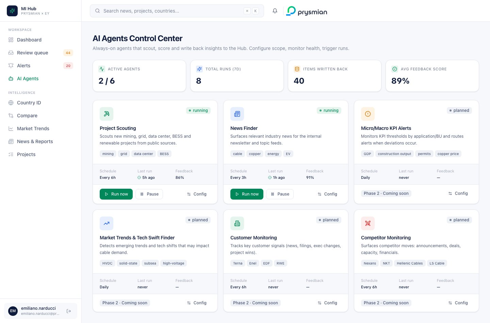

## 6.1 Top stat strip

| Tile                 | Meaning                                                  |
|----------------------|----------------------------------------------------------|
| Active agents        | Implemented + enabled / total catalog                    |
| Total runs (7d)      | Number of execution runs in the last week                |
| Items written back   | Items the agents have produced and written to the Hub    |
| Avg feedback score   | Average MI team approval rate across runs                |

## 6.2 The six agents

Each agent is shown as a card:

### Agent card anatomy

- **Color-coded icon** matching the agent category
- **Status badge** — `running` (green) · `paused` (amber) · `planned` (Phase 2)
- **Name + one-line description**
- **Keyword chips** showing the agent's taxonomy (e.g., for News Finder: `cable`, `copper`, `EV`, `grid`)
- **3-column metadata strip** — Schedule · Last run · Feedback %
- **Action row** — Run now · Pause/Resume · Config

### The six agents (Prysmian brief mapping)

| ID                  | Name                              | Status        | Purpose                                                  |
|---------------------|-----------------------------------|---------------|----------------------------------------------------------|
| project_scouting    | **Project Scouting**              | running ✅    | New mining/grid/data center/BESS/renewable projects      |
| news_finder         | **News Finder**                   | running ✅    | Industry news for the newsletter and topic feeds         |
| kpi_alerts          | **Micro/Macro KPI Alerts**        | planned (P2)  | KPI thresholds per application/BU                        |
| swift_finder        | **Market Trends Swift Finder**    | planned (P2)  | Emerging trends and tech shifts                          |
| customer_monitor    | **Customer Monitoring**           | planned (P2)  | Signals on Terna, Enel, EDF, RWE, TenneT, etc.          |
| competitor_monitor  | **Competitor Monitoring**         | planned (P2)  | Nexans, NKT, Hellenic Cables, LS Cable moves            |

## 6.3 Running an agent on demand

For an implemented agent, click **Run now** — the agent fires in the background (bounded run: max 3 items, 30s timeout). The status badge animates and the "Last run" updates when the run completes.

## 6.4 Pause / Resume

Click **Pause** to disable scheduled runs without losing config. The button toggles to **Resume**.

## 6.5 Agent configuration

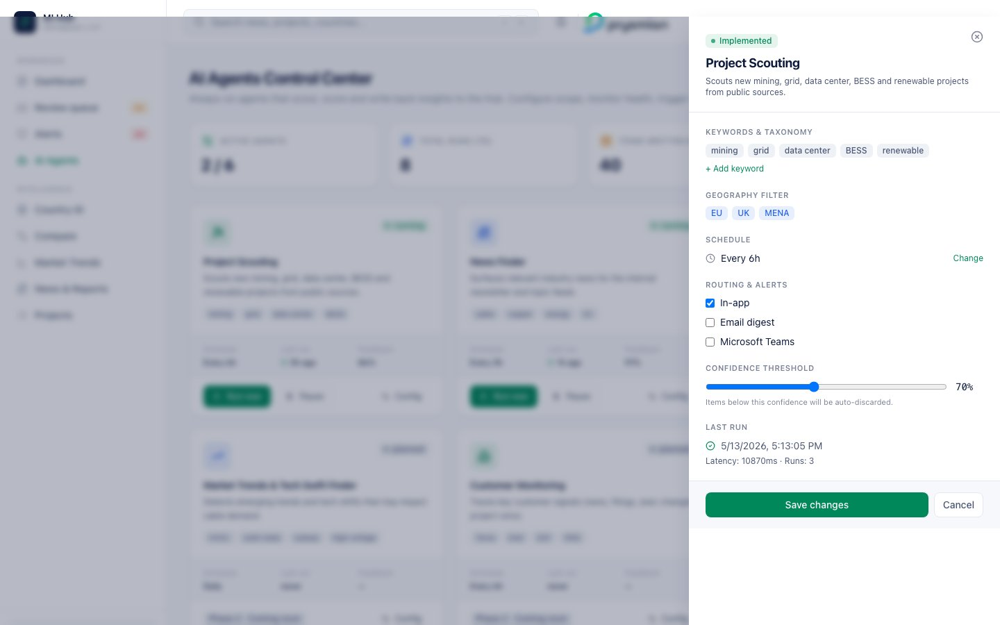

Clicking **Config** opens a right-side drawer with:

- **Keywords & taxonomy** — chip list of the agent's filter words. Click `+ Add keyword` to extend.
- **Geography filter** — which regions the agent monitors
- **Schedule** — current cadence ("Every 6h"). Click *Change* to modify.
- **Routing & alerts** — toggle channels: In-app · Email digest · Microsoft Teams
- **Confidence threshold** — slider 50–95% (default 70%). Items below this score are auto-discarded.
- **Last run** — timestamp, success/failure, latency, total runs

A **Save changes** / **Cancel** footer commits the config.

> In Phase 1 this maps to the agent's rule file and prompt template. Changes here re-deploy the agent with the new parameters.

---

# 7. Alerts & Subscriptions

Where you receive **triggered signals** — KPI deviations, project flags, news spikes, competitor moves.

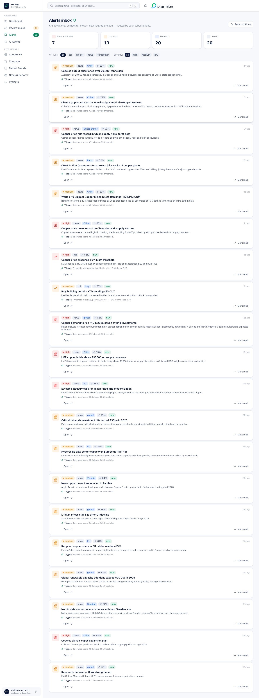

## 7.1 Stat strip

Four cards summarize the current state:

- **High severity** (red)
- **Medium** (amber)
- **Unread** (blue)
- **Total** (neutral)

## 7.2 Filter bar

Two filter rows:

- **Type:** `all` · `kpi` · `project` · `news` · `competitor`
- **Severity:** `all` · `high` · `medium` · `low`

## 7.3 Alert card

Each alert shows:

- **Type icon** — color-coded by severity (red/amber/blue)
- **Badges row** — severity, type, country, AI confidence %, optional `NEW` chip if unread
- **Age** — top right
- **Title** (bold)
- **Body** — 2-line summary
- **"Trigger"** callout — the rule that fired the alert (e.g., *"Threshold rule: copper_lme MoM > +5%. Confidence 0.92."*)
- **Action row** — `Open` (link to source) · `Mark read` (toggle)

Read items are dimmed at 60% opacity so unread items stand out.

## 7.4 Subscriptions

Click **Subscriptions** (top right) to open the preferences drawer.

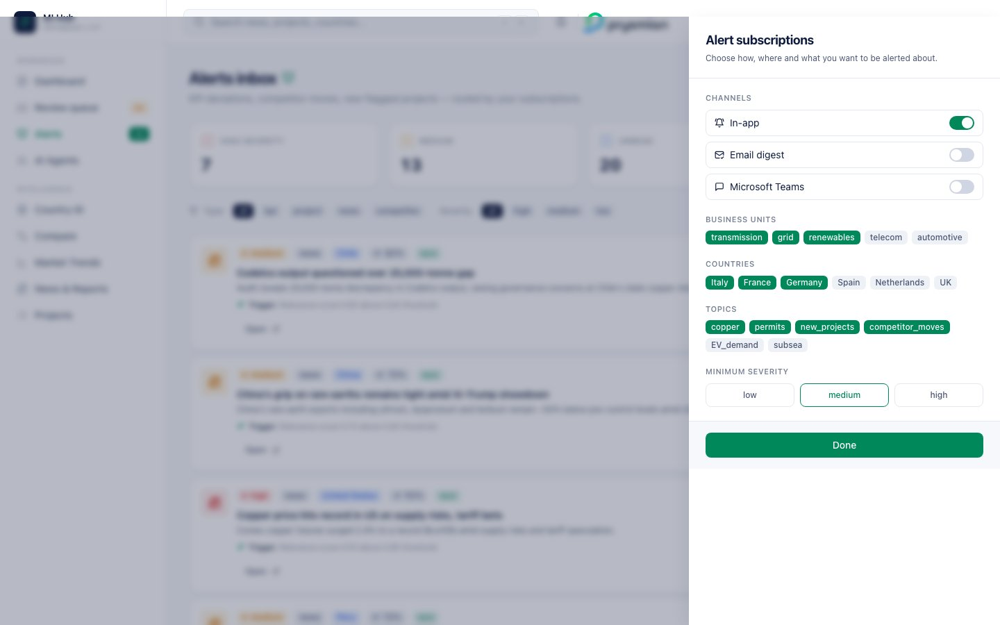

### 7.4.1 Channels

Toggle switches per channel:

- **In-app** — show in this inbox (always on by default)
- **Email digest** — daily roll-up email
- **Microsoft Teams** — direct message via Teams app

### 7.4.2 Business units

Chip-group selection: `transmission` · `grid` · `renewables` · `telecom` · `automotive`. Selected BUs show in Prysmian green.

### 7.4.3 Countries

Same UI for: `Italy` · `France` · `Germany` · `Spain` · `Netherlands` · `UK`

### 7.4.4 Topics

`copper` · `permits` · `new_projects` · `competitor_moves` · `EV_demand` · `subsea`

### 7.4.5 Minimum severity

Three-segment selector: alerts below this threshold are suppressed across all channels.

> All preferences save instantly — no Save button needed. They drive both the inbox filter and the channel routing in Phase 1.

---

# 8. Country ID

The **Country Identity Card** — a per-country deep-dive that mirrors the structure of the Prysmian briefing document (4 quadrants) but enriches each one with AI insights.

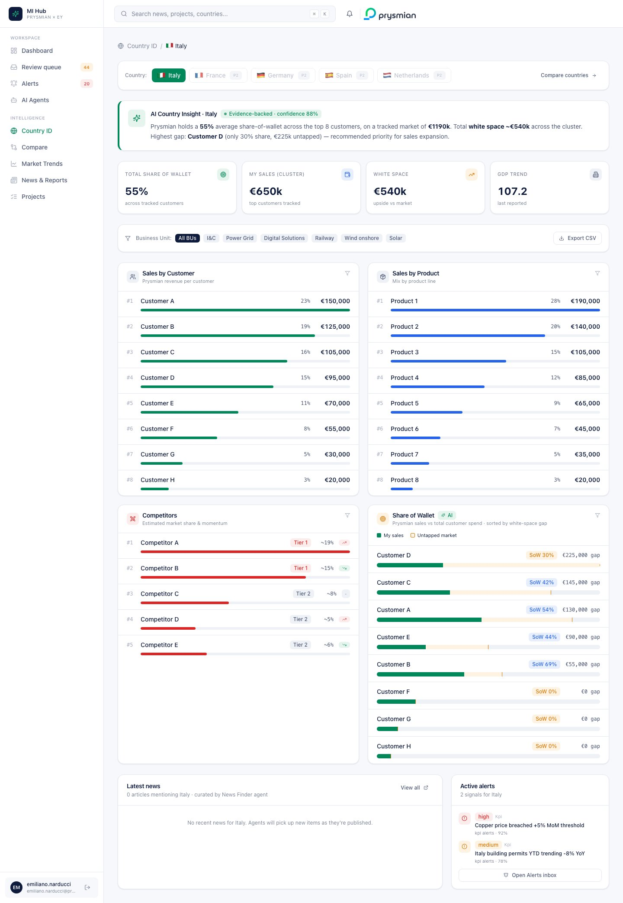

## 8.1 Breadcrumb and country switcher

A top breadcrumb (`Country ID › 🇮🇹 Italy`) plus a country switcher card with flag emojis. Italy has live demo data; other countries (France, Germany, Spain, Netherlands) are marked **P2** and show a Phase 2 placeholder.

## 8.2 AI Country Insight banner

A green-bordered card that **auto-narrates** the strategic story in natural language:

> Prysmian holds a 58% share-of-wallet across the top 8 customers, on a tracked market of €1,810k. Total white space ~€1,005k across the cluster. Highest gap: Customer D (only 30% share, €225k untapped) — recommended priority for sales expansion.

The narrative pulls real numbers from the database; it's not pre-written.

## 8.3 Macro snapshot tiles

Four KPI tiles:

| Tile                  | Meaning                                                   |
|-----------------------|-----------------------------------------------------------|
| Total share of wallet | Sum of Prysmian sales / sum of market value, all customers |
| My sales (cluster)    | Total Prysmian revenue tracked in this country            |
| White space           | Total upside vs market (market value − sales)             |
| GDP trend             | Latest GDP indicator value                                |

## 8.4 Filter bar

- **Business Unit chips** — `I&C` · `Power Grid` · `Digital Solutions` · `Railway` · `Wind onshore` · `Solar`
- **Export CSV** — top right. Downloads all 4 quadrants as a single CSV file (transition path from Excel).

## 8.5 The four quadrants

The platform preserves the Prysmian Excel mental model but transforms each quadrant into an *insight-rich* component.

### 8.5.1 Sales by Customer

- Rank number (#1, #2, …)
- Customer name (+ owner)
- Share % of total country sales
- Value in €
- Proportional **green bar** showing relative magnitude
- **Click any row** → drill-down modal (see §8.6)

### 8.5.2 Sales by Product

Same pattern as Customer, but **blue bars**.

### 8.5.3 Competitors

- **Tier badge** — `Tier 1` (red) or `Tier 2` (neutral)
- **Estimated market share %**
- **Momentum chip** — 📈 in salita (threat) · 📉 cala (favourable) · ⏸ flat
- Red bar showing relative share

### 8.5.4 Share of Wallet (AI insight) ⭐

The killer view. Each customer row shows:

- Customer name
- **SoW % badge** (red < 40%, blue 40–69%, green ≥ 70%)
- **€ gap** — untapped market for that customer
- **Stacked bar** — Prysmian green (your sales) + amber (gap) — visually shows the white-space opportunity

The list is **sorted by gap descending** — the biggest untapped customers float to the top.

## 8.6 Drill-down on a customer

Click any row in **Sales by Customer** or **Share of Wallet** to open a 2-tab modal.

### 8.6.1 Tab: MI Hub overview

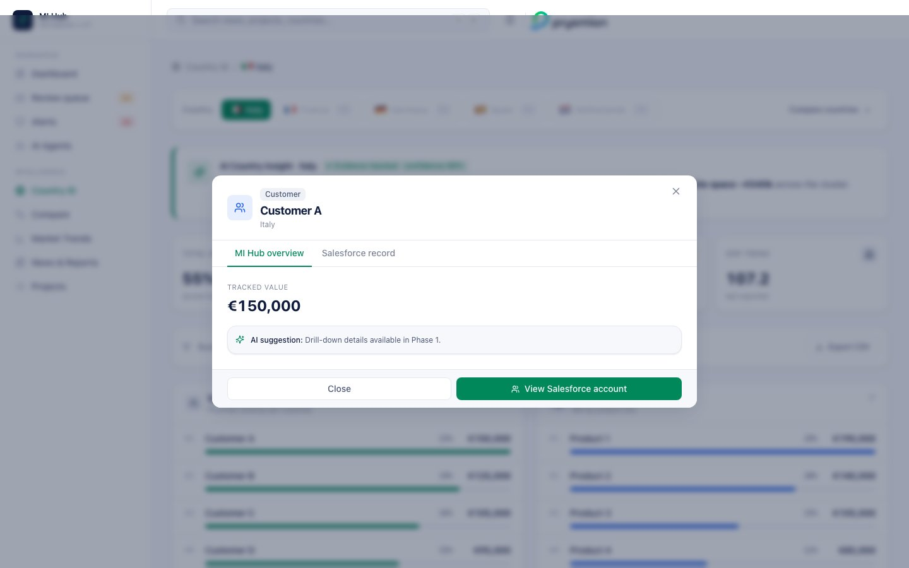

- Tracked value (€)
- Share of wallet bar
- Detail context
- **AI suggestion** card — adaptive recommendation:

  - SoW < 40% → "*Low share. Investigate competitor lock-in and propose share-shift initiative for Q3.*"
  - SoW 40–69% → "*Stable mid-share. Cross-sell adjacent product lines (HV, accessories) to lift wallet.*"
  - SoW ≥ 70% → "*Strong incumbent. Defend with multi-year framework and protect margin.*"

- Footer hint at Phase 1 unlocks: order history, contract list, pipeline, evidence trail.

### 8.6.2 Tab: Salesforce record

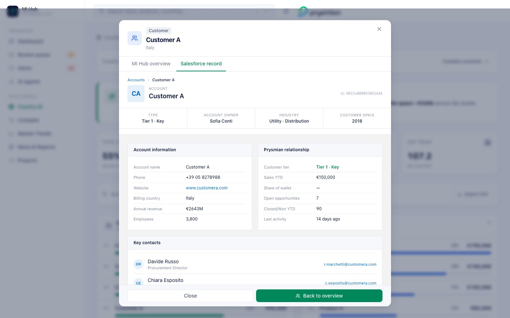

A **realistic Salesforce account page** rendering using deterministic synthetic data:

- Breadcrumb `Accounts › Customer A`
- Account avatar with initials, Account ID (e.g., `0015e000083065AAA`)
- **4-column highlight strip** — Type (Tier 1 · Key) · Account Owner (Sofia Conti) · Industry (Utility · Distribution) · Customer since (2018)

Then 4 panels:

- **Account information** — name, phone, website (clickable, blue), billing country, annual revenue (€), employees
- **Prysmian relationship** — customer tier, sales YTD, SoW %, open opps count, closed/won YTD, last activity
- **Key contacts** — 2 contacts with initials avatars, role and clickable email
- **Open opportunities** — table with stage badge (Qualification/Proposal/Negotiation), amount, close date

Footer notes that in Phase 1 the button links to the live `<customer>.my.salesforce.com` record.

## 8.7 Drill-down on a product

Click a row in **Sales by Product** to open the same modal but for products.

### 8.7.1 Tab: SAP material master

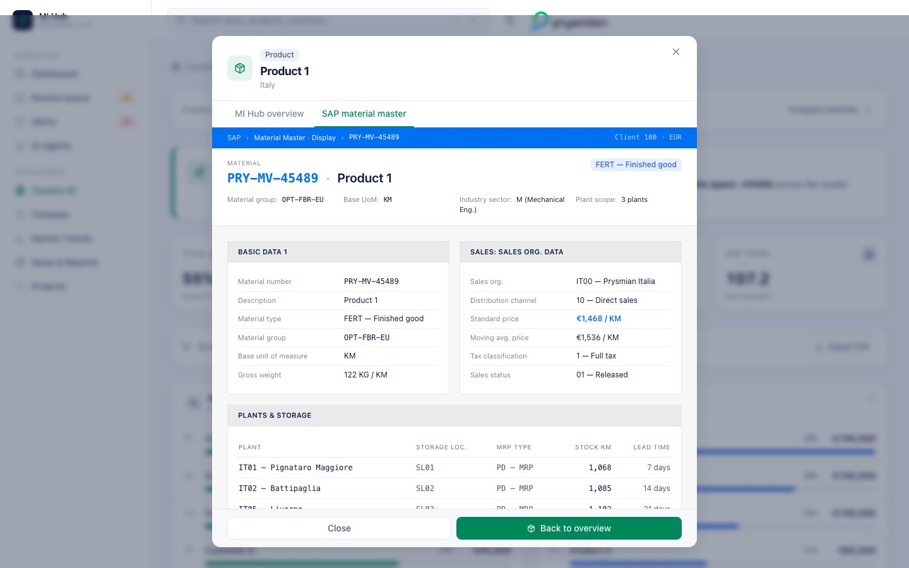

Renders a **SAP-Fiori-style material master**:

- **Top blue bar** (`#0070F2` SAP blue) with breadcrumb `SAP › Material Master · Display › PRY-MV-45489 · Client 100 · EUR`
- **Material header** — mono-coded `PRY-MV/HV/LV-XXXXX`, material type badge (`FERT — Finished good` / `HALB` / `ROH`)
- **4 metadata cells** — material group, base UoM (KM/M/KG), industry sector, plant scope

Four panels:

- **Basic data 1** — material number, description, type, group, base UoM, gross weight
- **Sales: sales org. data** — sales org (IT00 — Prysmian Italia), distribution channel, standard price, moving avg price, tax classification, sales status
- **Plants & storage** — table with plant codes (IT01 — Pignataro Maggiore, IT02 — Battipaglia, IT05 — Livorno), storage location, MRP type, stock, lead time
- **MI Hub link** — sales YTD, volume YTD, top customer

Footer notes that in Phase 1 the integration calls SAP RFC `BAPI_MATERIAL_GET_DETAIL`.

## 8.8 Country news + Active alerts

Below the quadrants:

- **Latest news** (wide) — articles mentioning this country, with source · time · "High" relevance chip if score ≥ 0.7. Click an item to open the source.
- **Active alerts** (narrow) — live alerts filtered by this country, with severity badge, agent label, confidence %. "Open Alerts inbox" button at the bottom.

---

# 9. Compare (multi-country)

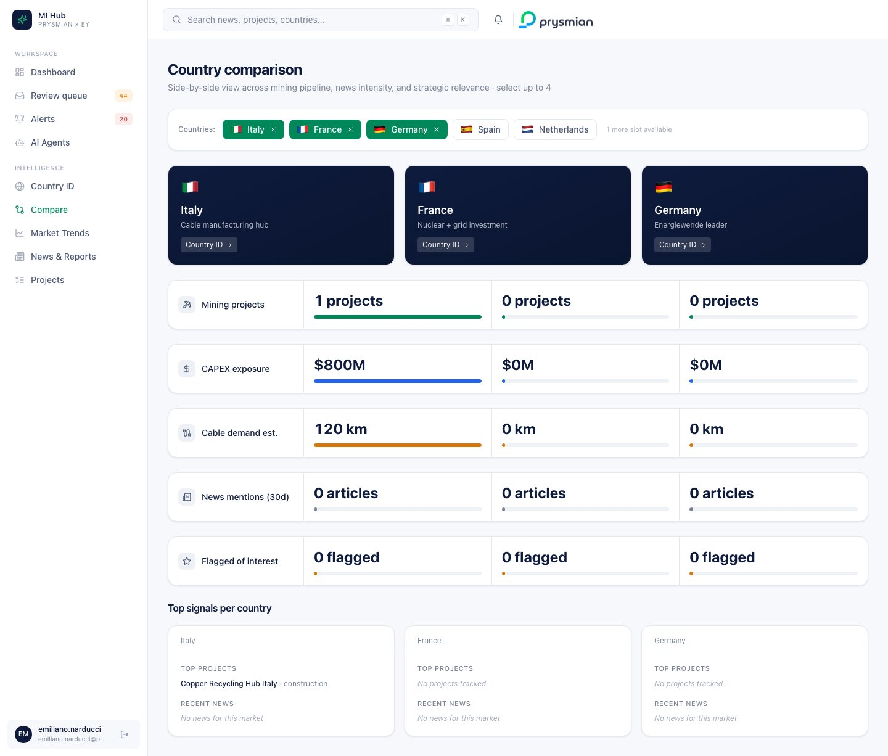

Side-by-side comparison of up to 4 countries.

## 9.1 Country selector

5 countries available, each with flag emoji and one-line focus blurb (e.g., Germany — "Energiewende leader"). Click to select/deselect. Active countries show in green; when 4 are selected, others are disabled.

## 9.2 Header tiles

For each selected country: a navy gradient card with flag, country name, focus tagline, and a *Country ID →* deep-link.

## 9.3 Comparable metric rows

Five rows, each showing the metric label on the left and the value per country with a **proportional bar** scaled across the cohort:

| Metric                | Source                       |
|-----------------------|------------------------------|
| Mining projects       | count of projects in country |
| CAPEX exposure        | sum of project CAPEX (€)     |
| Cable demand est.     | km estimate                  |
| News mentions (30d)   | news articles                |
| Flagged of interest   | strategic flags              |

## 9.4 Top signals row

Below the metric rows, a per-country panel with:

- **Top projects** (up to 3)
- **Recent news** (up to 3) — clickable to the source

---

# 10. Market Trends

Macroeconomic and commodity charts driving cable demand.

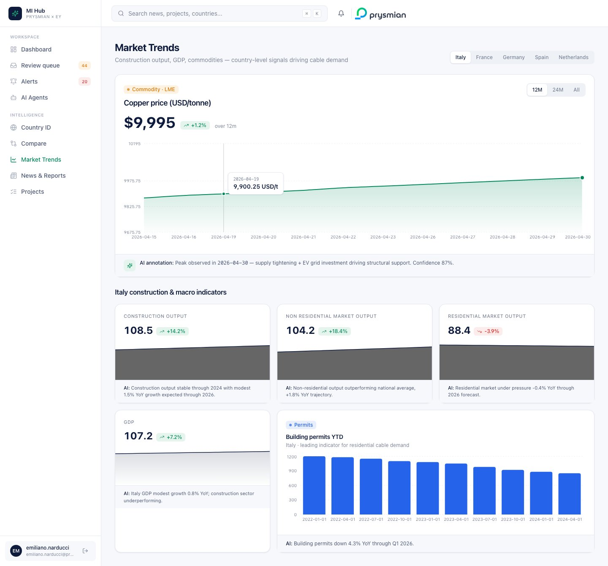

## 10.1 Top controls

- **Country switcher** — segmented control for the 5 EU countries
- **Time range** segmented control — `12M` · `24M` · `All`

## 10.2 Copper price hero card

The headline chart:

- Latest price + delta chip (% change over the selected range)
- **Area chart** with green gradient and a red dot marking the **peak**
- **AI annotation strip** under the chart explaining the move:

  > AI annotation: Peak observed in 2026-04 — supply tightening + EV grid investment driving structural support. Confidence 87%.

## 10.3 Indicator grid

For the selected country, mini-cards for the macro indicators:

- Construction output
- Non-residential market output
- Residential market output
- GDP

Each card shows: label, latest value, delta % chip, sparkline area chart, AI insight footer (one-line narrative from the agent).

## 10.4 Building permits YTD bar chart

A wider bar chart for **building permits** — a leading indicator for residential cable demand — with custom tooltips and AI insight footer.

---

# 11. Projects (pipeline tracker)

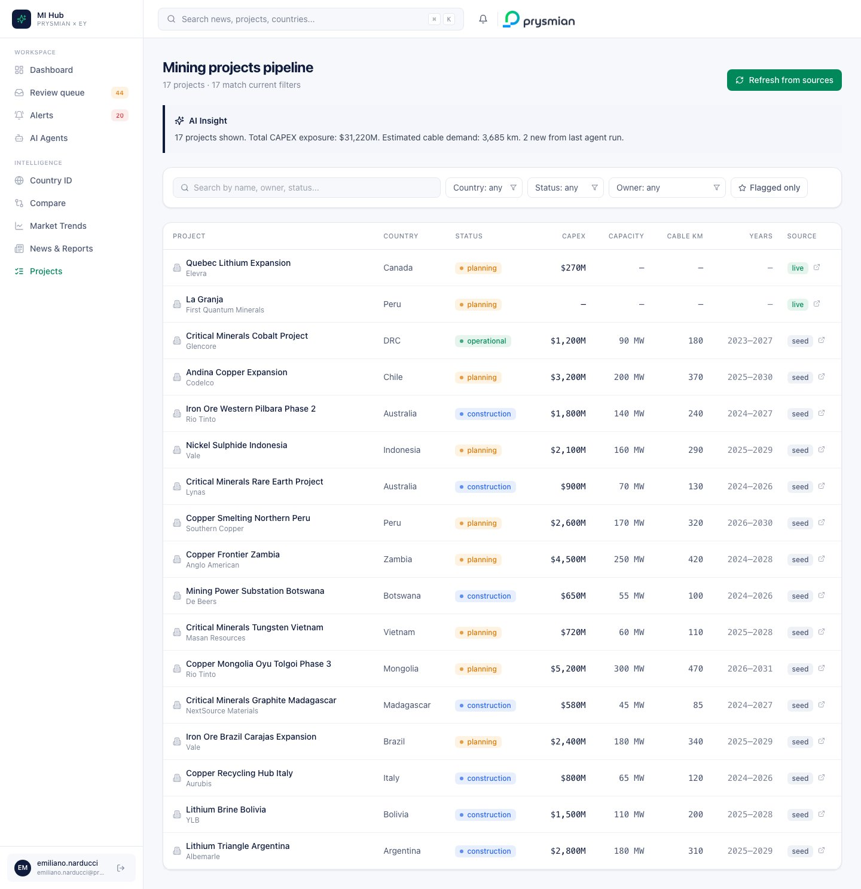

The mining/grid/renewable project pipeline.

## 11.1 Top bar

- Title with total count and filtered match count
- **Refresh from sources** — triggers the Project Scouting agent on-demand

## 11.2 AI Insight callout

One-sentence narrative summing up the filtered cohort:

> 17 projects shown. Total CAPEX exposure: $4,500M. Estimated cable demand: 420 km. 17 new from last agent run.

## 11.3 Filter bar

- **Search** — name, owner, country, status (text input with clear button)
- **Country** select
- **Status** select
- **Owner** select
- **Flagged only** toggle (star icon)
- **Clear filters** — appears when active

## 11.4 Project table

Columns:

| Column     | Notes                                                            |
|------------|------------------------------------------------------------------|
| Project    | Name (clickable to detail) + owner + ⭐ if flagged                |
| Country    |                                                                  |
| Status     | Colored badge (planning/under construction/operational)          |
| CAPEX      | `$XXXM`                                                          |
| Capacity   | `MW`                                                             |
| Cable km   | Estimated km of cable demand                                     |
| Years      | Start–End                                                        |
| Source     | `live` (from agent) or `seed`, with ↗ external-link icon         |

Click any row → **Project detail page**.

## 11.5 Project detail page

A drill-down screen with:

- Breadcrumb · Hero with badges, owner, country, status · Evidence + Source buttons
- **4 KPI tiles** — CAPEX · Capacity · Cable demand · Lifecycle
- **Project timeline** — auto-built milestones with colored status dots (Project announced · Permitting · Construction · Operational · End-of-life)
- **AI Insight** card — auto-narrated paragraph with confidence
- **Evidence trail** entry point
- **Related news** — articles mentioning the same country

---

# 12. News & Reports

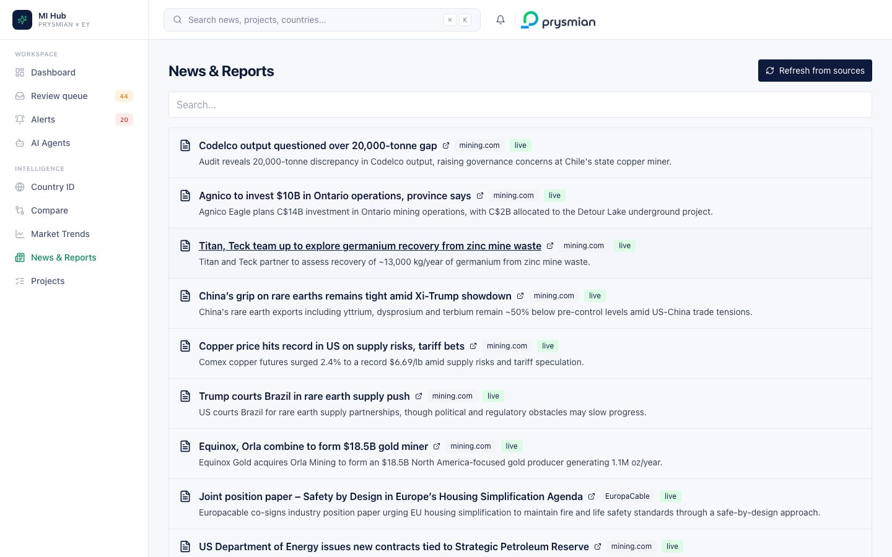

Full news feed (the **News Finder** agent's output). Filterable, searchable, with relevance scoring.

## 12.1 List view

For each article:

- Source · publication date
- Title (link to source)
- 2-line summary
- Country tags · segment tags
- Relevance score chip

Click the title to open the source in a new tab.

---

# 13. Evidence Bundle

Across the platform, anywhere you see an **Evidence bundle** button (Review queue detail, Project detail, AI Insight cards), clicking it opens a modal showing:

- The **source URL(s)** the AI used
- The **retrieval log** (timestamp, query, agent name)
- The **confidence breakdown** by sub-factor
- The **prompt template** version used

This is the **audit trail** the EU AI Act requires — every AI output is traceable to its sources and reasoning.

---

# 14. Logout

Click the **Logout** icon in the user pod at the bottom of the sidebar. You'll be redirected to the login screen and your session is cleared.

---

# 15. Roadmap

The demo build covers everything in the **MVP** scope of the Prysmian brief. The next two phases unlock:

## Phase 1 (post-MVP)

- Azure Entra ID SSO + RBAC
- Live SAP transactional ingestion (replacing demo seeds)
- Live Salesforce market-interaction ingestion
- Newsletter editorial workflow (validated → published → digest)
- 4 additional AI agents implemented (KPI Alerts, Swift Finder, Customer Monitor, Competitor Monitor)
- Real-time alerts via Email digest + Teams routing
- Versioning + diff view per Hub item

## Phase 2 (scale-out)

- API integrations for external databases and reports
- 75 users (consultation)
- Multi-country commercial seeds (France, Germany, Spain, Netherlands, UK)
- Manual structured "value data" input forms

---

# 16. Support

For demo issues: **emiliano.narducci@ey.com**
For platform questions: refer to this manual or the deploy doc (`docs/DEPLOY_RENDER.md`).

The demo is hosted on Render.com — free-plan services sleep after 15 min of inactivity (≈ 30s cold start on first wake).

---

*EY for Prysmian Group — Market Intelligence Hub user manual · May 2026*
